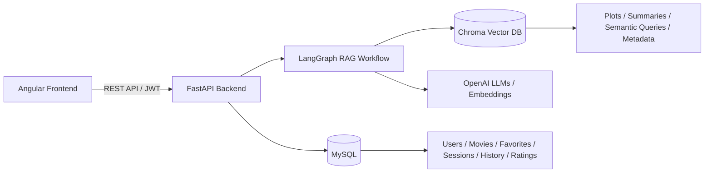
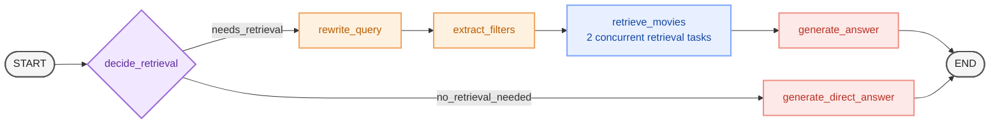

# AI Movie Search


### Screenshots

* **dystopia**
  

* **existence**
  

* **existenz**
  


* **conversation**
  

* **time**
  

* **nofiler_date**
  

* **admin_filterdate**
  

* **rate_limiter**
  

* **rate limiter**
  

* **ratelimit**
  

* **skoteinh tainia se nhsi**
  

* **scifi_philo**
  


Full-stack εφαρμογή αναζήτησης και εξερεύνησης ταινιών, η οποία συνδυάζει **Angular**, **FastAPI**, **MySQL**, **Chroma Vector Database** και τεχνικές **Generative AI / Retrieval-Augmented Generation (RAG)**.

[Αναλυτικη περιγραφη σε PDF](perigrafi_efarmogis_architektonikis.pdf)


Ο βασικός στόχος της εφαρμογής είναι να ξεπεράσει τους περιορισμούς μιας απλής keyword αναζήτησης. Εκτός από αναζήτηση με τίτλο, ο χρήστης μπορεί να περιγράψει σε φυσική γλώσσα το είδος ταινίας που ψάχνει, για παράδειγμα:

> «Θέλω μια σκοτεινή ταινία που εκτυλισεται σε νησι.»
 
> «Ταινία με διαστημικό ταξίδι όπου ο χρόνος κυλάει διαφορετικά»

> «Sci-fi detective movie with philosophical themes"(κανει filter genre retrieve)»

>Θέλω μια σκοτεινή sci-fi ταινία με φιλοσοφικό ύφος και μυστήριο. 

Ετσι ωστε ο χρήστης να μην περιορίζεται σε αναζητήσεις τύπου τίτλου ή genre, αλλά να μπορεί να περιγράφει ελεύθερα το είδος ιστορίας, ατμόσφαιρας ή θεματολογίας style, vibe που θέλει και το σύστημα να αναζητά τις πιο σχετικές ταινίες σημασιολογικά.

Το σύστημα αναλύει το αίτημα, δημιουργεί semantic query, εξάγει χρήσιμα φίλτρα και αναζητά σχετικές ταινίες στη vector database με βάση τη σημασιολογική ομοιότητα.

## Βασικές λειτουργίες

Η εφαρμογή υποστηρίζει:

- Register και login χρηστών με **JWT authentication**.
- Διαχωρισμό ρόλων **user / admin**.
- Αναζήτηση ταινιών με βάση τον τίτλο από τη MySQL.
- Προβολή πληροφοριών όπως title, year, director, genres και plot.
- Προσθήκη και αφαίρεση αγαπημένων ταινιών.
- Δημιουργία AI search/chat sessions με αποθηκευμένο ιστορικό.
- Semantic αναζήτηση ταινιών μέσω **Chroma embeddings**.
- Φιλτράρισμα με metadata όπως genre, excluded genre, director και year.
- Παραγωγή τελικής απάντησης από LLM με βάση τα retrieved movie documents.
- Admin διαχείριση ταινιών και συγχρονισμό τους με MySQL και Chroma.
- Παρακολούθηση token usage και estimated AI cost.
- Πειραματικό recommendation system με βάση ratings και favorites.

---

## Αρχιτεκτονική

Η εφαρμογή ακολουθεί full-stack αρχιτεκτονική.


Το **FastAPI backend**  διαχειριζεται το authentication, τα REST endpoints, την πρόσβαση στις βάσεις δεδομένων συνδιαζοντας σχεσιακη και vector db και την εκτέλεση του graph RAG workflow.

Το **Angular frontend** διαχειρίζεται το UI, προφυλασει το authorization-authentication state, τα user/admin views και την επικοινωνία με το backend.


---

## Αρχιτεκτονική Γραφου

Η εφαρμογή ακολουθεί full-stack αρχιτεκτονική.

content = """# MovieRAG Agent Architecture

> Agentic RAG workflow όπου ο agent αποφασίζει πρώτα αν χρειάζεται retrieval.
> Αν απαιτείται retrieve, ακολουθεί semantic RAG pipeline· διαφορετικά απαντά απευθείας.
> Με κάθε απαντηση του llm προς τον χρήστη ολοκληρώνεται ολοκληρος ο κύκλος του graph




## Flow

**Retrieval path**

`START → decide_retrieval → needs_retrieval → rewrite_query → extract_filters → retrieve_movies → generate_answer → END`

**Direct-answer path**

`START → decide_retrieval → no_retrieval_needed → generate_direct_answer → END`

### Retrieval logic

Το `retrieve_movies` είναι ένας κόμβος του LangGraph, αλλά εσωτερικά εκτελεί **2 concurrent retrieval tasks**.
Ο agent χρησιμοποιεί τα retrieved movie documents μαζί με τα extracted filters και το rewritten semantic query για να δημιουργήσει την τελική απάντηση.

---


H εφαρμογη χρησιμοποιει **conditional LangGraph workflow** αποφασιζοντας δυναμικα αν ενα user request απαιτει semantic retrieval ή όχι. Δηλαδη αν προκειται για ερωτηση ταινιας που χρειαζεται να ψαξει στην chroma ή αν μπορει να απαντηθει μεσω του ιστορικου η προκειται για απλη συζητηση του τυπου ("τι κανεις καλο μου ΑΙ?") να παραξει κατευθειαν την απαντηση "ειμαι ενας βοηθος ταινιων" χωρις να στειλει το query για retrieve

Για ερωτησεις πανω σε ταινιες movie-search requests, ο agent ξαναγραφει το query (rewrites query) ωστε να το καθαρισει απο τυγχων θορυβο επικενρωνοντας στο σεναριο που αναφερεται ο χρηστης, extracts structured filters, και στελνει 2 concurrent filtered retrieve tasks to the vector store, και τελειωνει με αξιολογηση του retrieve context παραγωντας την καταλληλη απαντηση σεναριου σχετικα με το query του χρηστη.

Για ερωτησεις που δεν απαιτουν retrieval, το workflow παραγει κατευειαν το τελικο response.

"""


Το graph αποφασίζει αρχικά αν απαιτείται νέα αναζήτηση. Αν χρειάζεται retrieval, το query καθαρίζεται και μετατρέπεται σε πιο κατάλληλη μορφή για semantic search.

Στη συνέχεια εξάγονται πιθανά structured filters, όπως:

- genres
- excluded genres
- director
- year

Η αναζήτηση στη Chroma γίνεται πάνω σε διαφορετικές σημασιολογικές αναπαραστάσεις των ταινιών και τα αποτελέσματα δίνονται σε LLM, το οποίο επιλέγει και εξηγεί τις πιο σχετικές προτάσεις.

---

## MySQL Database

Η **MySQL** χρησιμοποιείται για τα δομημένα και relational δεδομένα της εφαρμογής.

Ενδεικτικά αποθηκεύονται:

- Users
- Movies
- Genres
- Favorites
- Ratings
- Search Sessions
- Search History
- Recommendations

Η επικοινωνία με τη βάση γίνεται μέσω **SQLModel**, το οποίο συνδυάζει SQLAlchemy και Pydantic-style models.

Το `SearchHistory` χρησιμοποιείται επίσης για μόνιμη αποθήκευση στοιχείων όπως input/output tokens και estimated cost ανά AI request.

---

## Chroma Vector Database

Η **Chroma** αποτελεί τη semantic retrieval βάση του RAG συστήματος.

Κάθε vector document περιλαμβάνει:

```text
page_content
embedding
metadata
```

Το `page_content` μπορεί να περιέχει διαφορετικές μορφές πληροφορίας για την ίδια ταινία, όπως:

- summary
- full plot / plot representation
- paragraph chunk
- full-plot semantic query
- summary semantic query

Τα embeddings δημιουργούνται με **OpenAI `text-embedding-3-small`**.

Τα metadata περιλαμβάνουν πληροφορίες όπως:

- `movie_id`
- `title`
- `year`
- `director`
- `genres`
- `doc_type`
- genre flags, π.χ. `genre_comedy=True`

Με αυτόν τον τρόπο το σύστημα μπορεί να συνδυάζει **vector similarity search** με **structured metadata filtering**.

---

## Authentication και RBAC

Η εφαρμογή χρησιμοποιεί **JWT authentication**.

Μετά το login, το backend επιστρέφει access token, το οποίο χρησιμοποιείται από το Angular frontend στα protected requests μέσω HTTP interceptor.

Υπάρχουν δύο βασικοί ρόλοι:

- **User**: αναζήτηση ταινιών, favorites, AI sessions και recommendations.
- **Admin**: διαχείριση ταινιών και πρόσβαση σε analytics.

Το frontend χρησιμοποιεί τις πληροφορίες του token για navigation και διαφορετικό UI, ενώ οι πραγματικοί authorization έλεγχοι γίνονται και στο backend.

---

## Recommendation System

Το recommendation system είναι ξεχωριστό από το RAG movie search και βρίσκεται ακόμη σε πειραματικό στάδιο.

Όταν ένας χρήστης προσθέτει μια ταινία στα favorites, χρησιμοποιείται για απλοποίηση rating `5.0` και μπορεί να ενεργοποιηθεί background διαδικασία recommendation.

Η βασική υλοποίηση βασίζεται σε **item-based collaborative filtering**, χρησιμοποιώντας ratings από το **MovieLens 10M Dataset**.

Μελλοντική επέκταση μπορεί να συνδυάσει collaborative filtering με content-based semantic πληροφορία από τα embeddings και τα chunks των αγαπημένων ταινιών.

---

## Δεδομένα

Για τα movie plots χρησιμοποιείται dataset βασισμένο στο:

- `wiki_movie_plots_deduped.csv`

Από αυτό χρησιμοποιούνται κυρίως πεδία όπως:

```text
Year
Title
Director
Genre
Plot
```

Για το recommendation χρησιμοποιούνται δεδομένα από το **MovieLens 10M Dataset**, τα οποία συνδυάζονται με τα movie plot δεδομένα με βάση τίτλο και έτος.

Για το vectorstore έχουν επίσης παραχθεί με LLM:

- summaries
- synthetic semantic queries

ώστε κάθε ταινία να μπορεί να αναζητηθεί μέσα από διαφορετικές semantic representations.

---

## Technologies

| Layer | Technologies |
|---|---|
| Frontend | Angular, TypeScript, HttpClient |
| Backend | Python, FastAPI |
| ORM / Schemas | SQLModel, Pydantic, SQLAlchemy |
| Relational Database | MySQL |
| Vector Database | Chroma |
| AI / RAG | OpenAI, LangChain, LangGraph |
| Embeddings | `text-embedding-3-small` |
| Authentication | JWT / Bearer Token |
| Infrastructure | Docker, Docker Compose |
| Package Management | `uv` |

Το backend περιλαμβάνει επίσης custom **Error Handler Middleware**, **Rate Limiter** και **Cost Tracker** για πιο οργανωμένο error handling, περιορισμό requests και παρακολούθηση AI usage.

---

## Docker / Development

Η εφαρμογή μπορεί να εκτελεστεί μέσω **Docker Compose**, μαζί με τη MySQL.

Η τρέχουσα Docker λογική είναι κυρίως προσανατολισμένη σε development. Ο source code γίνεται bind mount από το local project directory προς το `/app` του backend container, ώστε οι αλλαγές στον κώδικα να είναι άμεσα διαθέσιμες μέσα στο container χωρίς νέο image build.

Το `uv` χρησιμοποιείται για τη διαχείριση των Python dependencies μέσα στο Docker environment.

---


# Running the Project

### requieres

- docker
- OPEN AI API KEY


## 1. Download or Clone the Repository

```bash
git clone https://github.com/tasosApostolou/RAG_movies.git
# cd <project_root>
```

---

## 2. cmd Setup — RAG_movies

Navigate to the project folder:

```bash
cd RAG_movies
```

### 3 Enter your OPEN_AI_API_KEY in .env File:

Open the .env file and find the OPEN_AI_API_KEY variable

Replace the value with your open ai api key in this line:

```bash
OPENAI_API_KEY="sk-proj-Enter-your-key-here"
```

#### 4 Check admin initialization in .env File

<p style="color: red; font-size: 18px; font-family: Arial;">When the app starts, it initializes the admin registration in database</p>
The default credentials for admin user there is in .env file

- FIRST_SUPERUSER=admin@example.com
- FIRST_SUPERUSER_PASSWORD=admin12345

<p>These are the credentials you have to enter as email and password to login in admin panel.
You could change before running the project replacing the default values with your valid credentials
valid email format and password should have greater than equal 8 chars </p>

- email: str -> Valid format of email
- password: str -> len(password) >= 8

### 5 Run With docker-compose

Build the containers

Inside the root folder:
```bash
cd RAG_movies
```
run with cmd or powershell vs-code terminal:
```bash
docker-compose up --build
```
the app it will have started when you see the log

- #### | INFO:     Application startup complete.

usually as:

- | INFO:     Started server process [145]
- | INFO:     Waiting for application startup.
- | INFO:     Application startup complete.

<p style="color: red; font-size: 18px; font-family: Arial;">So that means application has started but yet is not complete </p>
Database is empty and also vectorstore.

Yoy have to import the movie records in the database and also create the vectorstore with embeddings.
So i have generate 2 datasets for this and you have to execute 2 scripts

### Import Movies

for the sql importing movies i have generate the movies_plots.csv which is in path "RAG_movies\movies_semantic_plot\data\movies_plots.csv"

inside the Root RAG_movies folder execute the script-command to import movies
which executes the script RAG_movies\movies_semantic_plot\app\scripts.import_movies.py

##### open a new cmd/terminal in root folder
- "cd RAG_movies "

```bash
docker compose --profile tools run --rm import_movies
```
Please wait to import all movies

### Create Vectorstore

for the embedding vectorstore i recommend to use the without_chunks.csv dataset which is in path "RAG_movies\movies_semantic_plot\data\without_chunks.csv"

inside the Root RAG_movies folder execute the script-command to create vectorstore with embeddings
which executes the script RAG_movies\movies_semantic_plot\app\scripts.create_vectorstore.py

- cd RAG_movies
  
```bash
docker compose --profile tools run --rm create_vectorstore
```

<p style="color: green; font-size: 18px; font-family: Arial;"> #### please wait to create the vectorstore and your application is ready to use </p>


## WEB application available at:

```text
http://127.0.0.1:4200
```

FastAPI Swagger Docs:

```text
http://localhost:8000/docs
```

---