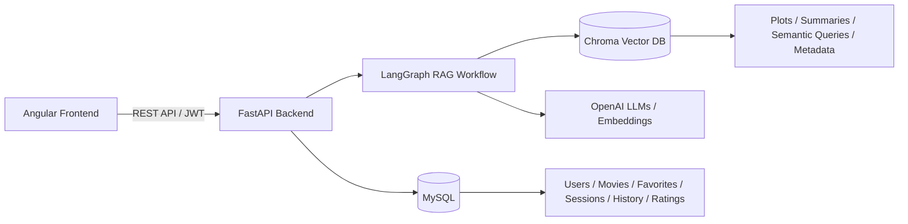
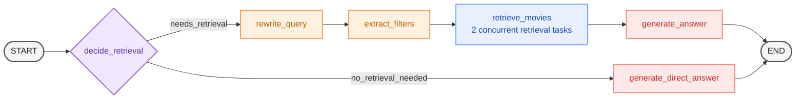

# AI Movie Search

### Screenshots

* **dystopia**
  

* **existence**
  

* **existenz**
  

* **conversation**
  

* **time**
  

* **nofiler_date**
  

* **admin_filterdate**
  

* **rate_limiter**
  

* **rate limiter**
  

* **ratelimit**
  

* **skoteinh tainia se nhsi**
  

* **scifi_philo**
  

---

A full-stack movie discovery application built with **Angular**, **FastAPI**, **MySQL**, **Chroma Vector Database**, and **Generative AI / Graph-RAG** techniques.

[Detailed architecture and implementation description (PDF)](perigrafi_efarmogis_architektonikis.pdf)

The main goal of the project is to go beyond traditional keyword-based movie search. In addition to searching by title, users can describe the kind of movie they are looking for in natural language, for example:

> "I want a dark movie set on an island."

> "A movie about space travel where time passes differently."

> "Sci-fi detective movie with philosophical themes." *(genre-aware retrieval)*

> "I want a dark sci-fi movie with philosophical themes and mystery."

Instead of being limited to exact titles or genre labels, users can describe a desired **story, atmosphere, theme, style, or overall vibe**, and the system retrieves movies based plot-description semantic similarity.

The application analyzes each request, builds a retrieval oriented semantic query, extracts relevant structured filters, and searches the vector database for semantically related movie content.

## Core Features

The application provides:

- User registration and login with **JWT authentication**.
- Role-based access for **regular users and administrators**.
- Traditional movie-title search backed by MySQL.
- Movie details including title, year, director, genres, and plot.
- Add/remove favorite movies.
- Persistent AI search chat sessions with conversation history.
- Semantic movie search using **Chroma embeddings**.
- Metadata-aware filtering by genre, excluded genre, director, and year.
- LLM-generated answers grounded in retrieved movie documents.
- Admin movie management with synchronization between MySQL and Chroma.
- Token usage and estimated AI cost tracking.
- An experimental recommendation system based on ratings and user favorites.

---

## Application Architecture

The project follows a full-stack architecture in which the frontend communicates with a FastAPI backend through REST endpoints protected by JWT authentication.


```mermaid
flowchart LR
    A[Angular Frontend] -->|REST API / JWT| B[FastAPI Backend]

    B --> C[(MySQL)]
    B --> D[LangGraph RAG Workflow]
    D --> E[(Chroma Vector DB)]
    D --> F[OpenAI LLMs / Embeddings]

    C --> G[Users / Movies / Favorites / Sessions / History / Ratings]
    E --> H[Plots / Summaries / Semantic Queries / Metadata]
```

The **FastAPI backend** handles authentication, REST endpoints, business logic, access to both relational and vector data stores, and execution of the RAG workflow.

The **Angular frontend** provides the user interface, manages authentication state and role-specific views, and communicates with the backend through HTTP services and interceptors.

---

## LangGraph RAG Architecture

The AI layer is implemented as a **conditional LangGraph workflow**. The agent first decides whether the current user request actually requires retrieval.

If retrieval is needed, the request is routed through the semantic RAG pipeline. If the request can be answered from the existing conversation context, or is simply conversational, the retrieval pipeline is skipped and a direct answer is generated.

Each completed LLM response ends the current graph execution cycle.


```mermaid
flowchart LR
    START([START]) --> D{decide_retrieval}

    D -->|needs_retrieval| RQ[rewrite_query]
    RQ --> EF[extract_filters]
    EF --> RM["retrieve_movies<br/>2 concurrent retrieval tasks"]
    RM --> GA[generate_answer]
    GA --> END([END])

    D -->|no_retrieval_needed| GDA[generate_direct_answer]
    GDA --> END

    classDef startEnd fill:#f5f5f5,stroke:#555,stroke-width:2px,color:#222;
    classDef decision fill:#f1e7ff,stroke:#9b6ad6,stroke-width:2px,color:#5f2ca0;
    classDef rag fill:#fff1df,stroke:#f0a35c,stroke-width:2px,color:#b85d00;
    classDef retrieval fill:#e8f0ff,stroke:#7ea6ff,stroke-width:2px,color:#1647a5;
    classDef answer fill:#fde9e7,stroke:#ef8f85,stroke-width:2px,color:#b83227;

    class START,END startEnd;
    class D decision;
    class RQ,EF rag;
    class RM retrieval;
    class GA,GDA answer;
```

### Execution Paths

**Retrieval path**

`START → decide_retrieval → needs_retrieval → rewrite_query → extract_filters → retrieve_movies → generate_answer → END`

**Direct-answer path**

`START → decide_retrieval → no_retrieval_needed → generate_direct_answer → END`


## Chroma Vector Database and data

**Chroma** is the semantic retrieval layer of the RAG system.

Embeddings are generated with **OpenAI `text-embedding-3-small`**.

Each vector document contains:

```text
page_content
embedding
metadata
```

The plots descriptions comes from wiki_movie_plots_deduped.csv dataset which contains the wikipedia descriptions of each movie which is long text with parapgraphs.
To improve the retrieval i use LLMs to generate summary of each movie and 2 simulated user-query for each movie. The generated simulated query represents a hypothetical user question about reference movie
So an LLM was used to generate one simulated user query for each movie based on full plot description and a second query based on summary which had also been generated by LLm.
Summary.
The simulated query generated by llm could match better with the actual user query or retrieve relevant simulated queries.
But summary maybe match better with a generic query, as well summary represents the general semantics.

So every movie has several represenations in chroma if it is summary or simulated query or a paragraph.
This is distinguished by metadata variable `doc_type`.

Depending on its `doc_type`, `page_content` may represent different semantic views of the same movie_id, including:

- summary
- full plot representation
- full-plot semantic query
- summary semantic query
- paragraph chunk

```text
 The idea is to retrieve using 2 or more concurrent retrieval tasks, filtered by doc_type. So for example one retrieve tasks brings only summaries filtered on doc_type=summary and the second filtered to brings only queries and chunks.
 ```

Document metadata can include:

- `movie_id`
- `title`
- `year`
- `director`
- `genres`
- `doc_type`
- genre flags such as `genre_comedy=True`

This design allows the retrieval layer to combine **vector similarity search** with **structured metadata filtering**.

---


### Retrieval Logic

`retrieve_movies` is a single LangGraph node that internally runs **two concurrent retrieval tasks**.

For movie-search requests, the agent rewrites the original query to remove conversational noise and focus on the actual semantic intent. It then extracts structured filters and performs concurrent retrieval against the vector store. The retrieved movie context is finally evaluated by the LLM to produce a grounded response aligned with the user's request.

For requests that do not require retrieval, the workflow bypasses vector search and generates the final response directly.

The graph can extract structured filters such as:

- genres
- excluded genres
- director
- year

Chroma stores multiple semantic representations of the same movie, allowing retrieval to match the user request against different forms of movie content before the final LLM evaluation.

The default retrieval pass usually returns documents of type semantic_query which is a simulated user query. These documents are LLM generated synthetic queries created for each movie in order to simulate the kinds of questions or descriptions a user might write. This improves semantic matching, because a user query can match a generated query even when the original plot uses different wording.

However, when the top-k value is relatively small, for example k=20, the default retrieval often returns mostly synthetic query documents and may not retrieve enough real plot or summary context. For that reason, the system performs a second retrieval pass that specifically filters for documents where doc_type = "summary". These summary documents contain condensed plot information and provide more direct context about the actual movie. 

Retrieved summaries docs aren't always the summaries of retrieved generated queries but the most cosine similar with user's query.  
This means that the same movie can be retrieved through both a synthetic query and its plot summary. When that happens, it is a stronger signal that the movie is relevant. The synthetic query matches the user's intent, while the summary provides real story context to support the recommendation.

Total retrieved docs are 20. 15 documents without extra filter(usuallly generated queries) and 5 documents with filter doc_type = summary context. 
   
After retrieval, another LLM receives all retrieved results, including synthetic queries and summaries, and judges which movies best match the user's request. The final recommendation is therefore not based only on vector similarity, but also on an LLM reasoning step that compares the retrieved evidence and decides which movies should be recommended.

    Search movies in Chroma with two retrieval passes with extra filter run concurrently with asyncio.gather:

    Retrieval passes:

    1. Retrieve 15 documents without doc_type filter.
       In practice these are usually semantic/synthetic simulated query docs.
       
    2. Retrieve 5 documents with filter doc_type="summary" which is the summary of movie plot.

    Normal metadata filters such as genres, excluded_genres, director, and year
    are still applied to both retrieval passes if user explicit requests.    

At this time i dont use doc_type filter for retrieve generated queries because usually are much retrieved first. At this time is an early implementation of my idea but still has significant room for improvement and future expansion. I dont have yet chunks but i could split plots into paragraphs which is too long descriptions (chunk-paragraph might be over than 2000 charachters and in future i could generate more simulated quries for each chunk-paragraph ant to increase a litle bit the temperature 0.2-0.3 with carefully prompting to recognize vibes,mood,emotion not just direct plot description, and also make evidence-reasoning by real plot paragraph generating score response. Additionaly i could generate tags as focus keywords or indicating mood,atmosphere,vibes. Then it might need more complex filter cases or rerank) as example of a future improvement expansion structured output:
    reference to movie "The matrix":

```json
[
  {
    "synthetic_query": "What movie has a rebel betray his crew because he wants to return to a comfortable fake reality?",
    "evidence": "Cypher betrays Morpheus to Smith in exchange for a comfortable life back in the Matrix.",
    "focus_tags": [
      "betrayal",
      "conflict",
      "temptation"
    ]
  },
  {
    "synthetic_query": "What sci-fi movie is about humans trapped in a simulated world while machines harvest their bodies for energy?",
    "evidence": "The Matrix is a simulation where harvested humans are trapped and pacified while machines use their bioelectric power.",
    "focus_tags": [
      "machine control",
      "dystopia",
      "simulation",
      "worldbuilding"
    ]
  }
]
```

    Above examples: synthetic_query is simulated query generated by llm for a chunk-paragraph, evidence is the context of each concrete chunk-paragpraph or summary, and focus are tags recognizing by llm.
    user can asks about psychological temptation, machine control...

    The plots that i managed to find, were too long for my project idea and consists of some long paragraphs and one paragraph migth have over than 2000 charachters. Unhappily these contents focus mainly in plot description and less in atmosphere, mood,vibes, emotionals such as small descriptions in movie websites could be embedded in one vector, which challenging the implementation of my idea (for making only 1 vector for each plot and one synthetic query about this and retrieve atmosphere, or emotionals as usually provided in such small descriptions) .
"""

---

## MySQL Database

**MySQL** stores the structured relational data used by the application.

Main entities include:

- Users
- Movies
- Genres
- Favorites
- Ratings
- Search Sessions
- Search History
- Recommendations

Database access is implemented with **SQLModel**, combining SQLAlchemy's ORM capabilities with Pydantic-style models and validation.

`SearchHistory` also provides persistent tracking of AI usage data such as input/output tokens and estimated cost per request.

---

## Authentication and RBAC

The application uses **JWT-based authentication**.

After login, the backend returns an access token that is automatically attached to protected Angular HTTP requests through an interceptor.

Two main roles are supported:

- **User**: movie search, favorites, AI sessions, and recommendations.
- **Admin**: movie management and usage analytics.

The frontend uses token information to control navigation and role-specific UI, while authorization is also enforced on the backend.

---

## Recommendation System

is not completed yet and also github didnt allow me to upload the entire dataset which includes 7 million records so this (movie_ratings.csv) is a small part of ratings and not works so good.

The recommendation system is separate from the RAG-based movie search and is currently **experimental**.

When a user adds a movie to favorites, the application can treat that preference as a `5.0` rating and use it as input to a background recommendation process for the sake of simplicity.

The current recommendation logic is based on **item-based collaborative filtering** using rating data from the **MovieLens 10M Dataset**.
The idea is to combine collaborative filtering item-based with content-based 
A future extension could combine collaborative filtering with content-based semantic signals derived from movie embeddings and plot chunks.

```text
The content-based component is still experimental, but the intended direction of my idea is to build a richer user interest profile from the semantic chunks of their favorite movies. Rather than representing each movie with a single vector, the system could cluster the chunks from a user’s favorites to identify distinct preference areas. For example, one cluster around dark science-fiction themes and another around stories set on isolated islands, without exactly a "dark scifi movie set on isolated island" being among his interests but it would be a perfect candidate. A key idea is that a candidate movie can match multiple dimensions of a user’s preferences through different plot chunks. For example, a sci-fi movie set on an island might contain one chunk strongly related to its science-fiction themes, while another focuses on the isolated island setting. These chunks could therefore fall close to different user-specific interest clusters in the embedding space.
Instead of just measuring similarity at the whole-movie level, the recommendation score could consider how many chunks from the same movie fall within a defined similarity radius of one or more cluster centroids. A distance threshold would determine whether a chunk is considered relevant to a cluster. Movies whose chunks match several distinct interest clusters —or produce multiple strong matches across them— would receive a higher content-based recommendation score.
Candidate movies could then be scored according to how many of their chunks fall sufficiently close to these interest clusters, using a distance threshold to determine meaningful matches. A movie whose different chunks align with multiple clusters would receive a stronger content-based score.
I could use HDBSCAN for clustering which is density base clustering method and noise isolation because i want to recognize the recurring interests of a user for example if a user has many chunks about "isolated island", and many chunks about "artificial inteligence" but only one chunk about "jungle" then it should should have set up two clusters, who one contains chunks related with "isolated island" and the other related "artificial intelligence", isolating "jungle" as outlier. I can reduce dismensionality using PCA or UMAP improving the performance of HDBSCAN clustering and also decreasing the noise keeping the variance explainability.
This semantic score could then be combined with the existing item-based collaborative filtering score through a weighted hybrid recommendation strategy, for example:
final_score = 0.5 × collaborative_score + 0.5 × content_score.
Because meaningful clustering requires enough user preference data, this component would only be activated after the user has accumulated a sufficient number of favorites. Since evaluating candidate movies against multiple user-specific clusters may be computationally expensive, the process would be better suited to asynchronous/background execution.
```


---

## Data Sources

Movie plot data is based on:

- `wiki_movie_plots_deduped.csv`

The application mainly uses fields such as:

```text
Year
Title
Director
Genre
Plot
```

Recommendation data comes from the **MovieLens 10M Dataset** and is matched with the movie-plot dataset using title and release year.

Additional semantic representations are generated with an LLM, including:

- summaries
- synthetic semantic queries

This allows each movie to be represented in multiple semantic forms inside the vector store.

---

## Technologies

| Layer | Technologies |
|---|---|
| Frontend | Angular, TypeScript, HttpClient |
| Backend | Python, FastAPI |
| ORM / Schemas | SQLModel, Pydantic, SQLAlchemy |
| Relational Database | MySQL |
| Vector Database | Chroma |
| AI / RAG | OpenAI, LangChain, LangGraph |
| Embeddings | `text-embedding-3-small` |
| Authentication | JWT / Bearer Token |
| Infrastructure | Docker, Docker Compose |
| Package Management | `uv` |

The backend also includes a custom **Error Handler Middleware**, **Rate Limiter**, and **Cost Tracker** for consistent API error responses, request throttling, and AI usage monitoring.

---

## Docker / Development

The application is containerized with **Docker Compose**, including the MySQL service.

The current Docker setup is primarily development-oriented. The project source directory is bind-mounted into `/app` inside the backend container, allowing local code changes to be reflected inside the container without rebuilding the image.

Python dependencies are managed with **uv** inside the Docker environment.

---

# Running the Project

### requieres

- docker
- OPEN AI API KEY


## 1. Download or Clone the Repository

```bash
git clone https://github.com/tasosApostolou/RAG_movies.git
# cd <project_root>
```

---

## 2. cmd Setup — RAG_movies

Navigate to the project folder:

```bash
cd RAG_movies
```

### 3 Enter your OPEN_AI_API_KEY in .env File:

Open the .env file and find the OPEN_AI_API_KEY variable

Replace the value with your open ai api key in this line:

```bash
OPENAI_API_KEY="sk-proj-Enter-your-key-here"
```

#### 4 Check admin initialization in .env File

<p style="color: red; font-size: 18px; font-family: Arial;">When the app starts, it initializes the admin registration in database</p>
The default credentials for admin user there is in .env file

- FIRST_SUPERUSER=admin@example.com
- FIRST_SUPERUSER_PASSWORD=admin12345

<p>These are the credentials you have to enter as email and password to login in admin panel.
You could change before running the project replacing the default values with your valid credentials
valid email format and password should have greater than equal 8 chars </p>

- email: str -> Valid format of email
- password: str -> len(password) >= 8

### 5 Run With docker-compose

Build the containers

Inside the root folder:
```bash
cd RAG_movies
```
run with cmd or powershell vs-code terminal:
```bash
docker-compose up --build
```
the app it will have started when you see the log

- #### | INFO:     Application startup complete.

usually as:

- | INFO:     Started server process [145]
- | INFO:     Waiting for application startup.
- | INFO:     Application startup complete.

<p style="color: red; font-size: 18px; font-family: Arial;">So that means application has started but yet is not complete </p>
Database is empty and also vectorstore.

Yoy have to import the movie records in the database and also create the vectorstore with embeddings.
So i have generate 2 datasets for this and you have to execute 2 scripts

### Import Movies

for the sql importing movies i have generate the movies_plots.csv which is in path "RAG_movies\movies_semantic_plot\data\movies_plots.csv"

inside the Root RAG_movies folder execute the script-command to import movies
which executes the script RAG_movies\movies_semantic_plot\app\scripts.import_movies.py

##### open a new cmd/terminal in root folder
- "cd RAG_movies "

```bash
docker compose --profile tools run --rm import_movies
```
Please wait to import all movies

### Create Vectorstore

for the embedding vectorstore i recommend to use the without_chunks.csv dataset which is in path "RAG_movies\movies_semantic_plot\data\without_chunks.csv"

inside the Root RAG_movies folder execute the script-command to create vectorstore with embeddings
which executes the script RAG_movies\movies_semantic_plot\app\scripts.create_vectorstore.py

- cd RAG_movies
  
```bash
docker compose --profile tools run --rm create_vectorstore
```

<p style="color: green; font-size: 18px; font-family: Arial;"> #### please wait to create the vectorstore and your application is ready to use </p>


## WEB application available at:

```text
http://127.0.0.1:4200
```

FastAPI Swagger Docs:

```text
http://localhost:8000/docs
```

---